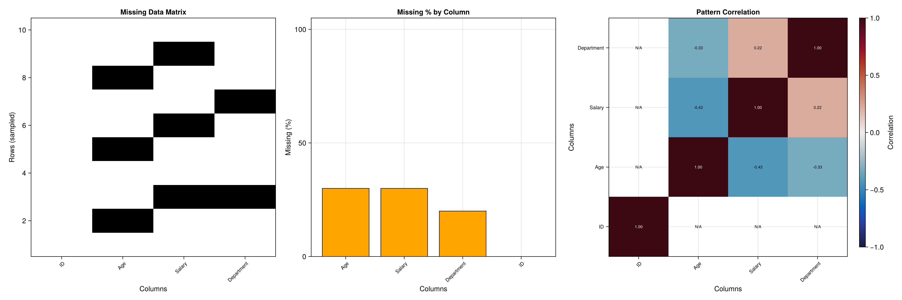
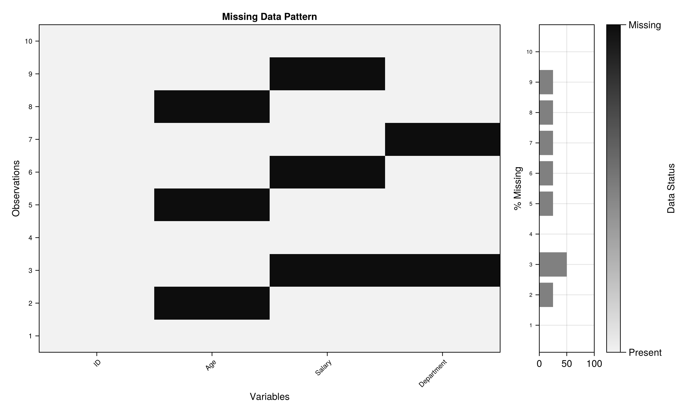
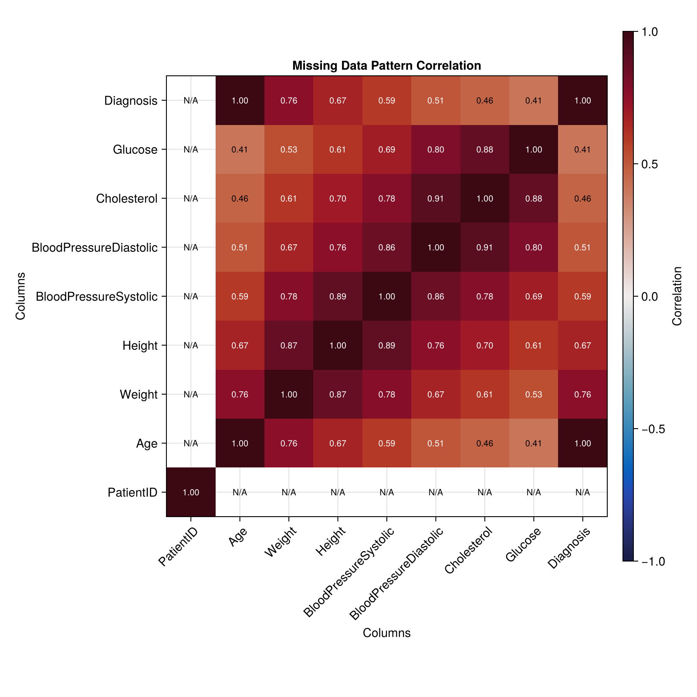

# MissingDataViz.jl

**Comprehensive missing data visualization and diagnosis for Julia DataFrames**

[](https://DescarteS96.github.io/MissingDataViz.jl/stable/)
[](https://DescarteS96.github.io/MissingDataViz.jl/dev/)
[](https://DescarteS96/MissingDataViz.jl/actions/workflows/CI.yml?query=branch%3Amaster)
[](https://codecov.io/gh/DescarteS96/MissingDataViz.jl)

---

## Features

- 🔍 **Automatic missing data detection** - Identify patterns and correlations in missingness
- 📊 **Rich visualizations** - Heatmaps, bar charts, correlation matrices, and overview dashboards
- 📄 **HTML report generation** - Standalone reports with embedded plots for easy sharing
- ⚡ **High performance** - Optimized for datasets with 10K+ rows
- 🎨 **Publication-quality plots** - Export to PNG, PDF, SVG with CairoMakie backend
- 🚀 **One-line workflow** - Complete analysis with `diagnose_missing(df)`

---

## Installation
```julia
using Pkg
Pkg.add("MissingDataViz")
```

Or from the Julia REPL:
```julia
] add MissingDataViz
```

---

## Quick Start
```julia
using MissingDataViz
using DataFrames

# Create sample data with missing values
df = DataFrame(
    Name = ["Alice", "Bob", missing, "David", "Eve"],
    Age = [25, missing, 30, missing, 35],
    Salary = [50000, 60000, missing, 70000, missing],
    Department = ["HR", "IT", "IT", missing, "HR"]
)

# One-line complete analysis
results = diagnose_missing(df)
# → Displays 4 plots automatically
# → Returns statistics and figures
```

---

## Screenshots

### Overview Dashboard
Complete analysis in a single view - matrix heatmap, bar chart, and correlation matrix combined.



### Missing Data Matrix
Detailed heatmap showing missing patterns across all observations and variables.



### Correlation Analysis
Identify variables that tend to be missing together (positive correlation) or independently (weak/negative correlation).



---

## Usage Examples

### Interactive Analysis
```julia
# Display plots and explore statistics
results = diagnose_missing(df)

# Access statistics
println("Total missing: ", results[:stats][:total_missing])
println("Overall percentage: ", results[:stats][:overall_percentage], "%")

# Check specific columns
for (col, stats) in results[:stats][:columns]
    if stats[:percentage] > 20
        println("⚠️  $col has $(stats[:percentage])% missing")
    end
end
```

### Generate HTML Report
```julia
# Create standalone HTML report for sharing
results = diagnose_missing(df, report=true, output="analysis.html")
println("Report saved to: ", results[:report_path])

# Open in browser (cross-platform)
if Sys.iswindows()
    run(`cmd /c start $(results[:report_path])`)
elseif Sys.isapple()
    run(`open $(results[:report_path])`)
else
    run(`xdg-open $(results[:report_path])`)
end
```

### Export Individual Plots
```julia
using CairoMakie

# Generate specific visualization
fig = plot_missing_matrix(df)

# Export to different formats
save("missing_matrix.png", fig)  # PNG
save("missing_matrix.pdf", fig)  # PDF (vector)
save("missing_matrix.svg", fig)  # SVG (editable)
```

---

## Visualizations

### Missing Data Matrix

Heatmap showing missing (black) vs present (white) values across all observations.
```julia
plot_missing_matrix(df)
```

### Missing Percentage Bar Chart

Bar chart displaying the percentage of missing values for each column with color-coded severity.
```julia
plot_missing_bars(df)
```

### Missingness Correlation Matrix

Correlation between missingness patterns across columns (ranges from -1 to +1).
```julia
plot_missing_correlation(df)
```

### Overview Dashboard

Combined view of all visualizations for comprehensive analysis.
```julia
plot_missing_overview(df)
```

---

## API Reference

### Main Functions

#### `diagnose_missing(df; kwargs...)`

Perform comprehensive missing data analysis with automatic visualization and reporting.

**Arguments:**
- `df::DataFrame` - Input data to analyze
- `report::Bool=false` - Generate HTML report (batch mode)
- `output::String="missing_report.html"` - Output path for HTML report
- `display::Bool=!report` - Display plots interactively
- `verbose::Bool=false` - Enable detailed logging

**Returns:** `Dict` with `:stats`, `:figures`, and optionally `:report_path`

---

#### `generate_html_report(df, output_file; title="...")`

Generate a comprehensive HTML report with missing data analysis and visualizations.

**Arguments:**
- `df::DataFrame` - Input data to analyze
- `output_file::String` - Path where HTML report will be saved
- `title::String="Missing Data Analysis Report"` - Report title

**Returns:** Absolute path to the generated HTML file

---

### Visualization Functions

- `plot_missing_matrix(df)` - Missing data matrix heatmap
- `plot_missing_bars(df)` - Bar chart of missing percentages
- `plot_missing_correlation(df)` - Correlation matrix of missingness patterns
- `plot_missing_overview(df)` - Combined overview dashboard

### Pattern Detection Functions

- `missing_pattern(df)` - Get missing data pattern matrix (boolean)
- `missing_percentage(df)` - Get percentage of missing values per column
- `missing_count(df)` - Get count of missing values per column
- `missing_correlation(df)` - Get correlation matrix of missingness patterns

---

## Performance

- **Interactive mode:** 150-250ms (display time depends on backend)
- **Batch mode:** 200-350ms (includes HTML generation and file write)
- **Memory:** ~50-100MB peak (temporary plot rendering)
- **Scalability:** Optimized for datasets with 10K+ rows

---

## Documentation

### Quick Reference
- 📖 **[User Guide](docs/USER_GUIDE.md)** - Comprehensive guide with examples
- 📚 **[Getting Started](docs/src/getting-started.md)** - Installation to first plot in 5 minutes
- 💡 **[Examples Gallery](examples/)** - 3 complete working examples (basic, medical, workflow)
- 🔗 **[API Reference](https://DescarteS96.github.io/MissingDataViz.jl/stable/)** - Detailed function documentation

### Theoretical Guides (Phase 2 - MCAR Tests)
- **[MCAR Means Test Guide](docs/guides/mcar_means_guide.md)**
  - Welch t-test for single numeric predictor
  - Mathematical foundations & interpretation
  - Decision tree & common pitfalls

- **[MCAR Logistic Regression Test Guide](docs/guides/mcar_logistic_guide.md)**
  - Logistic regression for multiple predictors
  - Handles categorical variables
  - Odds ratios & coefficient interpretation
  - Comparison with other tests

*More guides coming soon: Little's Test*

---

## Converting HTML Reports to PDF

The HTML report can be converted to PDF using your browser's Print to PDF feature:

1. Open the HTML report in your browser
2. Press `Ctrl+P` (Windows/Linux) or `Cmd+P` (macOS)
3. Select "Save as PDF" as the destination
4. Click "Save"

For automated batch conversion, you can use external tools like `wkhtmltopdf` or `pandoc`.

---

## Contributing

Contributions are welcome! Please feel free to submit a Pull Request.

1. Fork the repository
2. Create your feature branch (`git checkout -b feature/AmazingFeature`)
3. Commit your changes (`git commit -m 'Add some AmazingFeature'`)
4. Push to the branch (`git push origin feature/AmazingFeature`)
5. Open a Pull Request

---

## License

This project is licensed under the MIT License - see the [LICENSE](LICENSE) file for details.

---

## Acknowledgments

Built with:
- [DataFrames.jl](https://github.com/JuliaData/DataFrames.jl) - Data manipulation
- [Makie.jl](https://github.com/MakieOrg/Makie.jl) - Visualization framework
- [CairoMakie.jl](https://github.com/MakieOrg/Makie.jl/tree/master/CairoMakie) - Rendering backend

---

## Citation

If you use MissingDataViz.jl in your research, please cite:
```bibtex
@software{missingdataviz2025,
  author = {Ballamou, Rene Fassou},
  title = {MissingDataViz.jl: Comprehensive Missing Data Visualization for Julia},
  year = {2025},
  url = {https://github.com/DescarteS96/MissingDataViz.jl}
}
```

---

## Support

- **Issues:** [GitHub Issues](https://github.com/DescarteS96/MissingDataViz.jl/issues)
- **Discussions:** [GitHub Discussions](https://github.com/DescarteS96/MissingDataViz.jl/discussions)
- **Documentation:** [Online Docs](https://DescarteS96.github.io/MissingDataViz.jl)